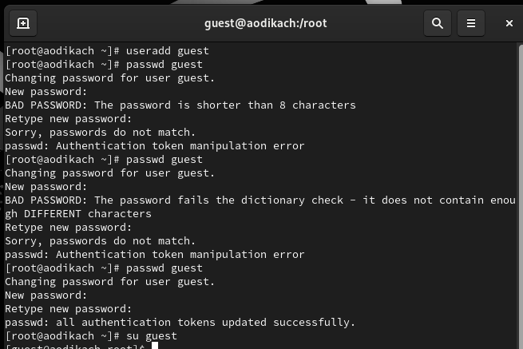
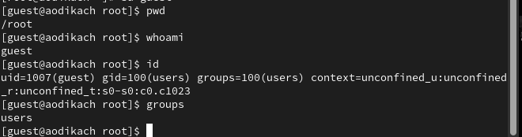
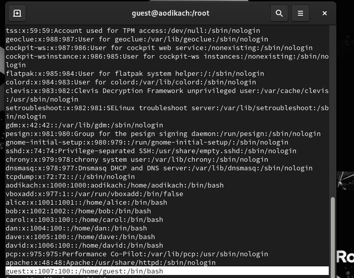
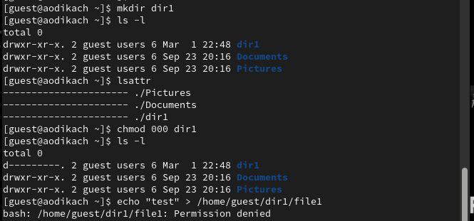
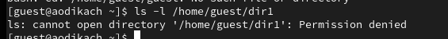
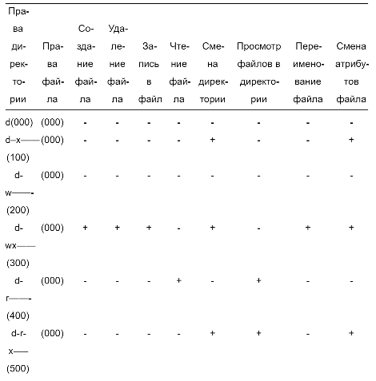

---
## Front matter
lang: ru-RU
title: Лабораторная Работа №3. Дискреционное разграничение прав в Linux. Два пользователя
subtitle: Основы информационной безопасности
author:
  - Дикач А.О.
institute:
  - Российский университет дружбы народов им. Патриса Лумумбы, Москва, Россия

## i18n babel
babel-lang: russian
babel-otherlangs: english

## Formatting pdf
toc: false
toc-title: Содержание
slide_level: 2
aspectratio: 169
section-titles: true
theme: metropolis
header-includes:
 - \metroset{progressbar=frametitle,sectionpage=progressbar,numbering=fraction}
 - '\makeatletter'
 - '\beamer@ignorenonframefalse'
 - '\makeatother'

## Fonts
mainfont: Arial
romanfont: Arial
sansfont: Arial
monofont: Arial
---

## Докладчик

  * Дикач Анна Олеговна
  * НПИбд-01-22
  * Российский университет дружбы народов
  * [1132222009@pfur.ru]
  * <https://github.com/ANNdamn/study_2023-2024_inf_bez>
  
# Вводная часть

## Цели и задачи

Получение практических навыков работы в консоли с атрибутами файлов для групп пользователей

# Выполнение лабораторной работы

## Создаю учётную запись пользователя guest, задаю пароль с помощью passwd guest и вхожу в систему

{#fig:001 width=70%}

## Определяю расположение директории с помощью pwd (вывод совпадает с приглашением командной строки). Уточняю имя с помощью whoami, уточняю имя  пользователя, группу, а также группы, куда входит пользователь, командой id. Далее ввожу groups. Выводы различаются, но несут одинаковую информацию

{#fig:002 width=50%}

## Просматриваю файл /etc/passwd с помощью cat, нахожу учётную запись, Uid пользователя 1007

{#fig:003 width=70%}

## Определяю существующие в системе директории командой ls -l /home/. Список поддиректорий доступен, все директории может читать и исправлять только пользователь. Проверяю установленные атрибуты с помощью lsattr /home.Удалось увидеть атрибуты всех расширенных территорий

{#fig:004 width=50%}

## Создаю поддиректорию в домашнем каталоге. Определяю права доступа и расширенные атрибуты. Все могут читать этот каталог, но его содержимое может изменить только владелец. Далее снимаю с директрии всае атрибуты командой chmod 000 dir1 и проверяю правильность выполнения. Доступа к поддиректории нет ни у кого. Проверяю верность теории с помощью echo "test" > /home/guest/dir1/file1 

{#fig:005 width=50%}

## Просматриваю как сообщение об ошибке отразилось на создании файла. Файл в директории, но недоступен 

{#fig:006 width=70%}

## Заполняю таблицу выполняя все требования 

{#fig:007 width=30%}

## Вывод

Получила навыки работы в консоли с атрибутами файлов, закрепила теоретические основы дискреционного разграничения доступа в современных системах с открытым кодом
