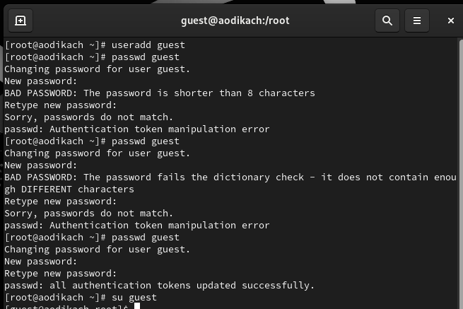
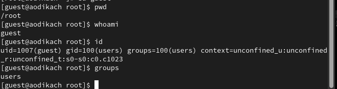
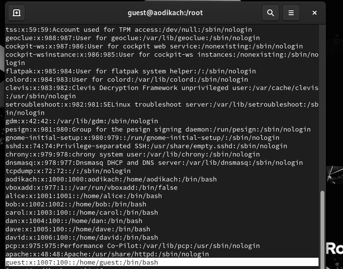
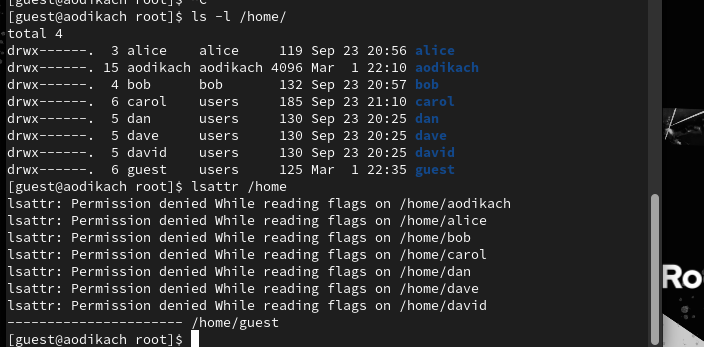
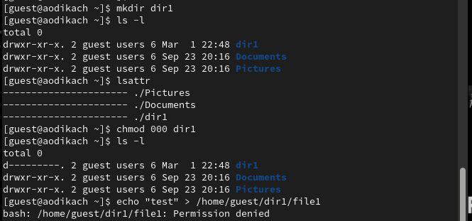
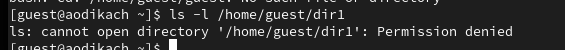
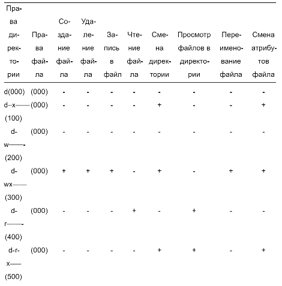

---
## Front matter
title: "Отчёт по лабораторной работе №3"
subtitle: "Дисциплина: Основы компьютерной безопасности"
author: "Дикач Анна Олеговна"

## Generic otions
lang: ru-RU
toc-title: "Содержание"

## Bibliography
bibliography: bib/cite.bib
csl: pandoc/csl/gost-r-7-0-5-2008-numeric.csl

## Pdf output format
toc: true # Table of contents
toc-depth: 2
lof: true # List of figures
lot: true # List of tables
fontsize: 12pt
linestretch: 1.5
papersize: a4
documentclass: scrreprt
## I18n polyglossia
polyglossia-lang:
  name: russian
polyglossia-otherlangs:
  name: english
## I18n babel
babel-lang: russian
babel-otherlangs: english
## Fonts
mainfont: Arial
romanfont: Arial
sansfont: Arial
monofont: Arial
mainfontoptions: Ligatures=TeX
romanfontoptions: Ligatures=TeX
sansfontoptions: Ligatures=TeX,Scale=MatchLowercase
monofontoptions: Scale=MatchLowercase,Scale=0.9
## Biblatex
biblatex: true
biblio-style: "gost-numeric"
biblatexoptions:
  - parentracker=true
  - backend=biber
  - hyperref=auto
  - language=auto
  - autolang=other*
  - citestyle=gost-numeric
## Pandoc-crossref LaTeX customization
figureTitle: "Рис."
tableTitle: "Таблица"
listingTitle: "Листинг"
lofTitle: "Список иллюстраций"
lotTitle: "Список таблиц"
lolTitle: "Листинги"
## Misc options
indent: true
header-includes:
  - \usepackage{indentfirst}
  - \usepackage{float} # keep figures where there are in the text
  - \floatplacement{figure}{H} # keep figures where there are in the text
---

# Цель работы

Получение практических навыков работы в консоли с атрибутами файлов для групп пользователей

# Выполнение лабораторной работы

1. Создаю учётную запись пользователя guest, задаю пароль с помощью passwd guest и вхожу в систему.  (рис. [-@fig:001])

{ #fig:001 width=70% }

2. Определяю расположение директории с помощью pwd (вывод совпадает с приглашением командной строки). Уточняю имя с помощью whoami, уточняю имя  пользователя, группу, а также группы, куда входит пользователь, командой id. Далее ввожу groups. Выводы различаются, но несут одинаковую информацию. (рис. [-@fig:002]) 

{ #fig:002 width=70% }

3. Просматриваю файл /etc/passwd с помощью cat, нахожу учётную запись, Uid пользователя 1007(рис. [-@fig:003])

{ #fig:003 width=70% }

4. Определяю существующие в системе директории командой ls -l /home/. Список поддиректорий доступен, все директории может читать и исправлять только пользователь. Проверяю установленные атрибуты с помощью lsattr /home.Удалось увидеть атрибуты всех расширенных территорий(рис. [-@fig:004])

{ #fig:004 width=70% }

5. Создаю поддиректорию в домашнем каталоге. Определяю права доступа и расширенные атрибуты. Все могут читать этот каталог, но его содержимое может изменить только владелец. Далее снимаю с директрии всае атрибуты командой chmod 000 dir1 и проверяю правильность выполнения. Доступа к поддиректории нет ни у кого. Проверяю верность теории с помощью echo "test" > /home/guest/dir1/file1 (рис. [-@fig:005])

{ #fig:005 width=70% }

6. Просматриваю как сообщение об ошибке отразилось на создании файла. Файл в директории, но недоступен (рис. [-@fig:006])

{ #fig:006 width=70% }

# Работа с таблицами

Заполняю таблицу выполняя все требования (рис. [-@fig:007])

{ #fig:007 width=70% }

# Выводы

Получила навыки работы в консоли с атрибутами файлов, закрепила теоретические основы дискреционного разграничения доступа в современных системах с открытым кодом.
