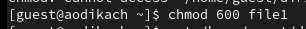
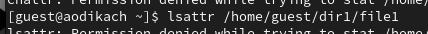

---
## Front matter
lang: ru-RU
title: Лабораторная Работа №4. Дискреционное разграничение прав в Linux. Расширенные атрибуты

subtitle: Операционные системы
author:
  - Дикач А.О.
institute:
  - Российский университет дружбы народов им. Патриса Лумумбы, Москва, Россия

## i18n babel
babel-lang: russian
babel-otherlangs: english

## Formatting pdf
toc: false
toc-title: Содержание
slide_level: 2
aspectratio: 169
section-titles: true
theme: metropolis
header-includes:
 - \metroset{progressbar=frametitle,sectionpage=progressbar,numbering=fraction}
 - '\makeatletter'
 - '\beamer@ignorenonframefalse'
 - '\makeatother'

## Fonts
mainfont: Arial
romanfont: Arial
sansfont: Arial
monofont: Arial
---

## Докладчик

  * Дикач Анна Олеговна
  * НПИбд-01-22
  * Российский университет дружбы народов
  * [1132222009@pfur.ru]
  * < https://github.com/ANNdamn/inf_bez_project
  
# Вводная часть

## Цели и задачи

Получение практических навыков работы в консоли с расширенными атрибутами файлов.

## От имени пользователя guest определяю расширенные атрибуты файла командой lsattr /home/guest/dir1/file1 

{#fig:001 width=70%}

## Устанавливаю на файл file1 права, разрешающие чтение и запись для владельца файла с помощью команды chmod 600 file1 

{#fig:002 width=60%}

## Пробую установить на файл расширенный атрибут a и проверяю правильность установки с помощью команды lsattr /home/guest/dir1/file1 

{#fig:003 width=70%}
{#fig:004 width=70%}

## Выполняю дозапись слова «test» в файл и читаю исправленный файл с помощью cat /home/guest/dir1/file1

{#fig:005 width=70%}

{#fig:006 width=70%}

## . Пробую удалить в файле строку с помощью echo "abcd" > /home/guest/dirl/file1. Попытка переименования файла неудачная. Снимаю расширенный атрибут с файла с помощью chattr -a /home/guest/dir1/file1  

{#fig:007 width=70%}

## Вывод

В результате данной работы я повысила навыки использования интерфейса командной строки, познакомилась с расширенными атрибутами.

