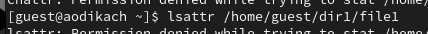
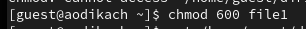
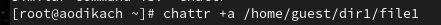
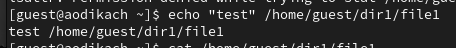
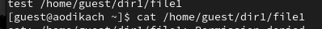
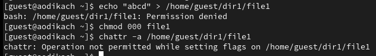

---
## Front matter
title: "Отчёт по лабораторной работе №4"
subtitle: "Дисциплина: Архитектура компьютера"
author: "Дикач Анна Олеговна НПИбд-01-22"

## Generic otions
lang: ru-RU
toc-title: "Содержание"

## Bibliography
bibliography: bib/cite.bib
csl: pandoc/csl/gost-r-7-0-5-2008-numeric.csl

## Pdf output format
toc: true # Table of contents
toc-depth: 2
lof: true # List of figures
lot: true # List of tables
fontsize: 12pt
linestretch: 1.5
papersize: a4
documentclass: scrreprt
## I18n polyglossia
polyglossia-lang:
  name: russian
polyglossia-otherlangs:
  name: english
## I18n babel
babel-lang: russian
babel-otherlangs: english
## Fonts
mainfont: Arial
romanfont: Arial
sansfont: Arial
monofont: Arial
mainfontoptions: Ligatures=TeX
romanfontoptions: Ligatures=TeX
sansfontoptions: Ligatures=TeX,Scale=MatchLowercase
monofontoptions: Scale=MatchLowercase,Scale=0.9
## Biblatex
biblatex: true
biblio-style: "gost-numeric"
biblatexoptions:
  - parentracker=true
  - backend=biber
  - hyperref=auto
  - language=auto
  - autolang=other*
  - citestyle=gost-numeric
## Pandoc-crossref LaTeX customization
figureTitle: "Рис."
tableTitle: "Таблица"
listingTitle: "Листинг"
lofTitle: "Список иллюстраций"
lotTitle: "Список таблиц"
lolTitle: "Листинги"
## Misc options
indent: true
header-includes:
  - \usepackage{indentfirst}
  - \usepackage{float} # keep figures where there are in the text
  - \floatplacement{figure}{H} # keep figures where there are in the text
---

# Цель работы

Получение практических навыков работы в консоли с расширенными атрибутами файлов.

# Выполнение лабораторной работы

1. От имени пользователя guest определяю расширенные атрибуты файла командой lsattr /home/guest/dir1/file1 (рис. [-@fig:001])

{ #fig:001 width=70% }

2. Устанавливаю на файл file1 права, разрешающие чтение и запись для владельца файла с помощью команды chmod 600 file1 (рис. [-@fig:002]). 

{ #fig:002 width=70% }

3. Пробую установить на файл расширенный атрибут a и проверяю правильность установки с помощью команды lsattr /home/guest/dir1/file1 (рис. [-@fig:003]) (рис. [-@fig:004]).

{ #fig:003 width=70% }

{ #fig:004 width=70% }

4.  Выполняю дозапись слова «test» в файл и читаю исправленный файл с помощью cat /home/guest/dir1/file1 (рис. [-@fig:005]) (рис. [-@fig:006]). 

{ #fig:005 width=70% }

{ #fig:006 width=70% }

5. Пробую удалить в файле строку с помощью echo "abcd" > /home/guest/dirl/file1. Попытка переименования файла неудачная. Снимаю расширенный атрибут с файла с помощью chattr -a /home/guest/dir1/file1  (рис. [-@fig:007]). 

{ #fig:007 width=70% }

# Выводы

В результате данной работы я повысила навыки использования интерфейса командной строки, познакомилась с расширенными атрибутами.
